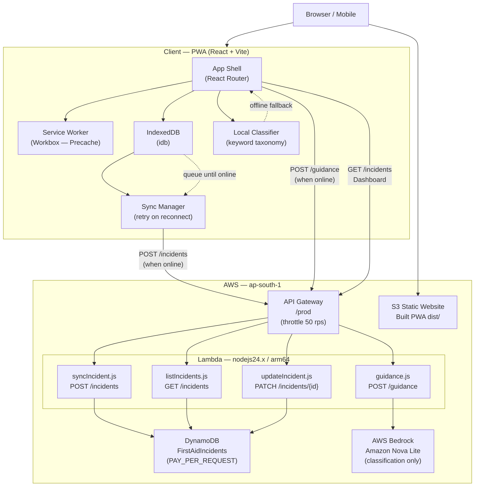
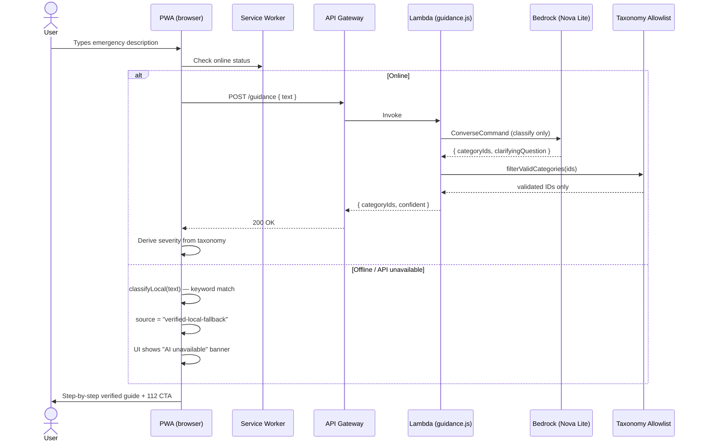
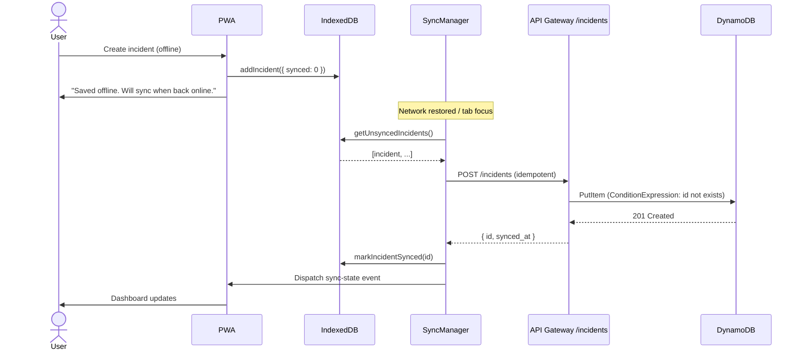

# FirstAidFlow

**Offline-first emergency guidance and incident coordination — AWS Serverless PWA**

[](https://aws.amazon.com/serverless/sam/)
[](https://aws.amazon.com/bedrock/)
[](https://react.dev/)
[](https://web.dev/progressive-web-apps/)
[](LICENSE)

FirstAidFlow is a Progressive Web App that delivers verified step-by-step first-aid guidance and real-time incident coordination support for emergency responders and bystanders. It supports offline emergency guidance, local classification, and incident logging without a network connection. When connectivity is available, AWS services provide cloud-based classification and incident synchronization.

> Built for the **First Commit Hackathon 2026**

---

## Authors

| Name | GitHub |
|---|---|
| Swathi B Raj | [@t0k1t00](https://github.com/t0k1t00) |
| Sripriya P | [@Sripriyaaa777](https://github.com/Sripriyaaa777) |

---

## Live Demo

| Endpoint | URL |
|---|---|
| PWA | http://firstaidflow-web-604006982307-ap-south-1.s3-website.ap-south-1.amazonaws.com |

> **Note:** Served over HTTP via S3 static website hosting (CloudFront pending account verification). PWA install requires HTTPS — use Firefox or a browser that permits localhost-equivalent installs, or wait for CloudFront activation.

---

## What It Does

- Guides any bystander through a first-aid emergency step by step — even with no signal
- Classifies free-text descriptions ("someone is choking and can't breathe") into one of 52 recognised emergency categories using **AWS Bedrock (Amazon Nova Lite)**
- Falls back to a deterministic local keyword classifier when offline — the AI is augmentation, not a dependency
- Logs and syncs incidents to a coordinator dashboard with severity indicators, map view, and surge detection
- Severity is always derived from the taxonomy, never from AI output — the model cannot escalate or downgrade triage on its own

---

## Architecture



### Request flow — Emergency Guidance



### Offline → Sync flow



---

## Emergency Coverage

### 52 Recognised Categories across 6 Groups

| Group | Total | With Guide | Escalation-Only |
|---|---|---|---|
| Trauma & Injury | 18 | 14 | 4 |
| Burns & Environmental | 8 | 7 | 1 |
| Breathing & Airway | 7 | 6 | 1 |
| Cardiac & Neurological | 7 | 6 | 1 |
| Poisoning & Exposure | 5 | 4 | 1 |
| Acute Medical | 7 | 2 | 5 |
| **Total** | **52** | **27 guides** | **13 escalation-only** |

**Escalation-only categories** (e.g. crush injury, neck/spinal injury, carbon monoxide) advise calling emergency services immediately. No fictional step-by-step guide is bundled for them — because getting professional help started *is* the correct first-aid response.

**12 additional categories** share an existing guide where the response is identical or closely related (e.g. *Amputation* uses the *Severe Bleeding* guide; *Frostbite* uses the *Hypothermia* guide; *Drug Overdose* uses the *Poisoning* guide).

---

## Tech Stack

### Frontend
| | |
|---|---|
| Framework | React 18 + Vite |
| Offline | Workbox (GenerateSW, precache-all) |
| Local storage | IndexedDB via `idb` |
| Routing | React Router v6 |
| Icons | Custom SVG icon set (zero emojis) |
| Fonts | Inter + IBM Plex Mono (Google Fonts) |
| PWA | Manifest, service worker, installable |

### Backend
| | |
|---|---|
| IaC | AWS SAM (CloudFormation) |
| Runtime | Node.js 24.x / arm64 |
| Format | ESM (`type: "module"`) |
| API | Amazon API Gateway REST (prod stage) |
| Compute | AWS Lambda × 4 functions |
| Database | Amazon DynamoDB (PAY_PER_REQUEST) |
| AI | Amazon Bedrock — Nova Lite (classification only) |
| Hosting | Amazon S3 static website |
| SDK | AWS SDK v3 (provided by runtime — zero bundled deps) |

---

## Repository Layout

```
FirstAid-main/
├── backend/
│   ├── src/
│   │   ├── guidance.js          # POST /guidance — Bedrock classification
│   │   ├── syncIncident.js      # POST /incidents — create + validate
│   │   ├── listIncidents.js     # GET  /incidents — cursor-paginated list
│   │   ├── updateIncident.js    # PATCH /incidents/{id} — resolve
│   │   ├── categories.js        # 52-category allowlist + severity resolver
│   │   └── lib/response.js      # CORS + JSON helpers
│   └── template.yaml            # SAM template (all AWS resources)
├── frontend/
│   ├── src/
│   │   ├── components/          # React UI components
│   │   ├── guides/              # 27 verified guide JSON files + index
│   │   ├── lib/
│   │   │   ├── emergencyTaxonomy.js   # 52-category taxonomy (single source of truth)
│   │   │   ├── emergencyClassifier.js # Bedrock + local fallback
│   │   │   ├── priority.js            # Severity display logic
│   │   │   ├── surge.js               # Deterministic surge detection
│   │   │   └── cluster.js             # Incident map clustering
│   │   ├── db/incidents.js      # IndexedDB CRUD (idb)
│   │   ├── sync/syncManager.js  # Offline → online sync queue
│   │   └── incidents/logIncident.js  # Incident creation helpers
│   ├── .env.example
│   └── vite.config.js
└── scripts/
    ├── deploy-backend.sh
    ├── deploy-frontend.sh
    └── test-backend.mjs
```

---

## API Reference

All endpoints are under the deployed API Gateway base URL.

### `POST /guidance`
Classifies a free-text emergency description using Amazon Bedrock. Returns validated category IDs from the 52-entry allowlist only.

```json
// Request
{ "text": "Someone is bleeding heavily from their leg." }

// Response 200
{
  "categoryIds": ["severe-bleeding"],
  "clarifyingQuestion": null,
  "confident": true,
  "guideId": "severe-bleeding"
}
```

### `POST /incidents`
Creates and syncs an incident. UUID, timestamp, and category ID are validated server-side. Severity is derived from the taxonomy — never trusted from the client.

```json
// Request
{
  "id": "550e8400-e29b-41d4-a716-446655440000",
  "categoryIds": ["severe-bleeding"],
  "timestamp": "2026-09-20T14:00:00Z",
  "resolved": false,
  "source": "guide",
  "lat": 8.5241,
  "lng": 76.9366
}

// Response 201
{ "id": "550e8400-...", "synced_at": "2026-09-20T14:00:01.234Z" }
```

### `GET /incidents?limit=50&cursor=<token>`
Returns a cursor-paginated list of incidents.

```json
{
  "incidents": [...],
  "count": 50,
  "nextCursor": "eyJpZCI6..." // null when no more pages
}
```

### `PATCH /incidents/{id}`
Resolves or re-opens an incident.

```json
// Request
{ "status": "resolved" }

// Response 200
{ "id": "...", "status": "resolved", "resolved": true, "updated_at": "..." }
```

---

## Offline Mode

The following functions without any network connection after the first load:

- Emergency guidance console (local keyword classifier across all 52 categories)
- All 27 guide walkthroughs (precached by service worker)
- Category browse and search
- Incident creation (stored in IndexedDB with `synced: 0`)
- Automatic sync when connectivity is restored — POST is idempotent (duplicate IDs are silently accepted)

The UI is explicit about the distinction:
- When Bedrock is unavailable: banner reads *"AI guidance is unavailable. Verified emergency guidance remains available."*
- There are no fake AI responses — the local classifier is labelled as local.

---

## AI Safety Constraints

AWS Bedrock is used **only for classification** — it maps free-text to taxonomy IDs. It cannot:

- Generate medical treatment instructions
- Invent category IDs outside the 52-entry allowlist
- Override severity — severity is always resolved from `category → taxonomy urgency → display level`
- Set the `urgentOverride` flag visible to the frontend — this field is discarded in `guidance.js`

The prompt passed to the model explicitly states:
> *"You are not a doctor. Do NOT diagnose, prescribe medication, invent treatment instructions, or advise delaying emergency services."*

All returned IDs are validated through `filterValidCategories()` before any response is sent to the client.

---

## Local Development

```bash
# Frontend (no backend needed — runs in full offline mode)
cd frontend
cp .env.example .env
# Leave VITE_API_BASE_URL empty for offline-only mode
npm ci
npm run dev
# → http://localhost:5173

# Backend (requires Docker and AWS credentials)
cd backend
sam build
sam local start-api --region ap-south-1
```

---

## Deployment

### Backend (AWS SAM)

```bash
cd backend
sam build
sam deploy --guided  # First time — stores config in samconfig.toml
# Subsequent deploys:
sam build && sam deploy
```

SAM outputs the API Gateway URL. Copy it for the frontend step.

### Frontend (S3)

```bash
cd frontend
# Set the deployed API Gateway URL
echo "VITE_API_BASE_URL=https://<api-id>.execute-api.ap-south-1.amazonaws.com/prod" > .env
echo "VITE_EMERGENCY_NUMBER=112" >> .env
echo "VITE_EMERGENCY_LABEL=India" >> .env

npm ci && npm run build

# Upload to the S3 bucket from SAM outputs
aws s3 sync dist/ s3://<WebBucketName>/ --delete --region ap-south-1
```

### CloudFront (when account is verified)

```bash
aws cloudfront create-invalidation \
  --distribution-id <DistributionId> \
  --paths "/*"

# Lock CORS to the CloudFront origin
sam deploy --parameter-overrides AllowedOrigin=https://<your-cloudfront-domain>.cloudfront.net
```

---

## Configuration

| Variable | Description | Default |
|---|---|---|
| `VITE_API_BASE_URL` | API Gateway stage URL. Empty = full offline mode. | *(empty)* |
| `VITE_EMERGENCY_NUMBER` | Number dialled by "Call now" buttons | `112` |
| `VITE_EMERGENCY_LABEL` | Label shown next to emergency number | `India` |
| `GuidanceModelId` | SAM parameter — Bedrock model ID | `amazon.nova-lite-v1:0` |
| `AllowedOrigin` | SAM parameter — CORS allowed origin | `*` |

> **Bedrock in ap-south-1:** Amazon Nova Lite requires an inference profile for invocation in this region. The exact inference profile available to an AWS account may depend on regional and account configuration. Check the available profiles with:
>
> ```bash
> aws bedrock list-inference-profiles --region ap-south-1
> ```
>
> Configure `GuidanceModelId` with an inference profile that is available and permitted for the account.

---

## CI/CD

GitLab CI pipeline (`.gitlab-ci.yml`) runs two stages on every push:

| Stage | Job | What it does |
|---|---|---|
| `validate` | `validate-backend` | `sam validate --lint` — catches template errors before deploy |
| `build` | `build-frontend` | `npm install && npm run build` — produces `frontend/dist/` artifact |

---

## Medical Safety

FirstAidFlow provides first-aid guidance only. It does not:

- Diagnose medical conditions
- Prescribe medication
- Replace emergency medical professionals
- Guarantee outcomes

In all life-threatening situations, the app prioritises calling emergency services (**112** in India). Verified guides are the sole source of first-aid instructions. For the 13 escalation-only categories, the app advises calling emergency services immediately and does not present a step-by-step guide.

---

## Guide Sources

All 27 guidance guides are paraphrased from authoritative first-aid organisations. Content is never invented.

| Organisation | Coverage |
|---|---|
| British Red Cross | Bleeding, choking, burns, CPR, fractures |
| St John Ambulance | Bleeding, choking, burns, bones, unconsciousness |
| NHS (UK) | Stroke, seizures, allergic reaction, head injury |
| Asthma + Lung UK | Asthma emergencies |
| Stroke Association (UK) | Stroke — FAST recognition |
| Epilepsy Action (UK) | Seizure management |
| American Heart Association | CPR and cardiac emergencies |

Full per-guide source attributions are visible in the app under `/sources`.

---

## License

MIT — see [LICENSE](LICENSE).
